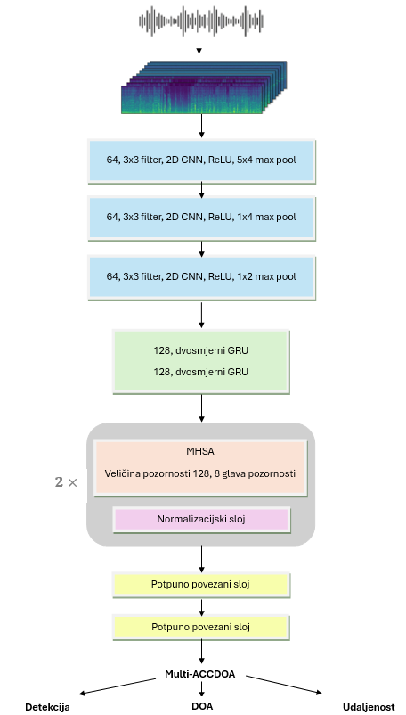

# SELD zadatak - optimizacija hiperparametara
U repozitoriju je implementiran SELDnet model za skup podataka snimljenog tetraedatskim mikrofonom. Iz skupa podataka su izdvojene značajke Mel spektrogrami i GCC značajke, a izlazni format je Multi-ACCDOA. Korištena arhitektura osnovnog modela prikazana je ispod:

Skup podataka se može preuzeti na linku: [Sony-TAu Realistic Spatial Soundscapes 2023 (STARSS23)](https://zenodo.org/records/7709052). Potrebno je pruzeti MIC skup podataka.

- parameters.py sadrži sve postavljene parametere za podatke, značajke i model. Putanju do skupa podataka je potrebno ovdje staviti kao i putanju do direktorija u koji će se spremati obrađeni podaci. 

- optimization.py implementira Bayesovu optimizaciju pomoću Optuna biblioteke. Svi parametri optimizacije su prilagodljivi.

### Process:
1. Za izdvajanje značajki iz skupa podataka:

`python3 batch_feature_extraction.py`

2. Za treniranje osnovnog SELDnet modela:

`python3 train_seldnet.py`

3. Za pokretanje optimizacije pomoću Optuna biblioteke:

`python3 optimization.py`
Za spremanje rezultata potrebno je uvesti Joblib biblioteku. 

Kod je baziran na
[osnovnoj implementaciji u DCASE SELD izazovu 2024](https://github.com/partha2409/DCASE2024_seld_baseline)
